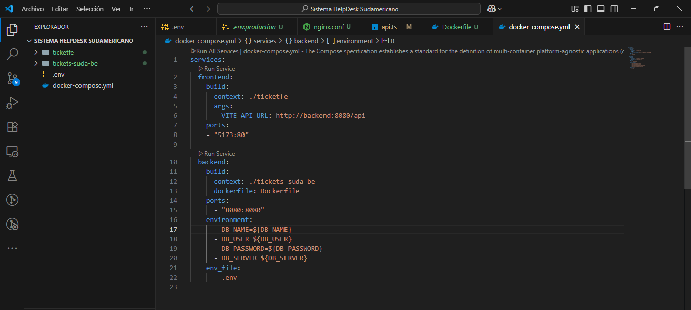

## 1. Título
TAS10 - Aplicación en modo producción

## 2. Tiempo de duración
45 minutos aproximadamente para desarrollar la práctica.

## 3. Fundamentos:
Hoy en día, el desarrollo de aplicaciones web modernas se basa en separar claramente dos partes: el frontend, que es la interfaz visual que usan los usuarios, y el backend, que maneja toda la lógica detrás como guardar datos, procesar información o conectarse a bases de datos. Esta división permite que los desarrolladores trabajen de forma más organizada y eficiente. Según Arrieta y Viloria (2022), esta estructura ayuda a mejorar la escalabilidad de los sistemas y facilita su mantenimiento.

Además, para que estas aplicaciones funcionen de manera confiable en distintos entornos, usamos herramientas como Docker, que nos permite “empaquetar” nuestras apps en contenedores. Estos contenedores incluyen todo lo que el software necesita para funcionar, así evitamos el clásico “en mi máquina sí funciona”. Como explican Lozano et al. (2020), Docker ayuda a automatizar el despliegue y asegura que el sistema funcione igual en desarrollo, pruebas y producción.

Por otro lado, el uso de bases de datos modernas como PostgreSQL, especialmente en servicios en la nube como Neon, permite que los datos estén disponibles desde cualquier parte con alta seguridad y rendimiento. La nube, como plantea González (2019), es clave para ofrecer servicios rápidos, confiables y accesibles.

Para finalizar, este proyecto aprovecha buenas prácticas actuales del desarrollo web: separar frontend y backend, usar Docker para contenerizar y PostgreSQL en la nube para manejar los datos.

## 4. Conocimientos previos.
- Fundamentos de Desarrollo Web (Frontend y Backend).
- Manejo de Docker y Contenedores.
- Conexión a Bases de Datos PostgreSQL.
- Uso de Archivos de Configuración (.env, Dockerfile, docker-compose.yml).

## 5. Objetivos a alcanzar
- Desplegar la aplicación frontend en modo producción utilizando un contenedor de Nginx, junto con los contenedores correspondientes a la base de datos y al backend.

## 6. Equipo necesario:
- Computadora con sistema operativo Windows o Linux.

## 7. Material de apoyo.
- Documentación oficial de Docker y Docker Compose.
- Manual de configuración de Spring Boot con variables de entorno.
- Guías de despliegue con Nginx para aplicaciones React.
  
## 8. Procedimiento
### Paso 1: Procedemos a crear y codificar el Dockerfile en el Backend.

### Paso 2: Crear y codificar el .dockerignore, .env.production, Dockerfile y nginx.conf del Frontend.

### Paso 3: Crear y codificar el .env y docker-compose-yml en el directorio raíz.

### Paso 4: Levantar el proyecto y visualizar en el navegador.

## 9. Resultados esperados:
- Se esperaba desplegar correctamente la aplicación en producción usando contenedores Docker para el frontend (Nginx), backend (Spring Boot) y la base de datos (Neon). Aunque el frontend y backend funcionaron, no se logró conectar la base de datos al proyecto.

## 10. Bibliografía
- Arrieta, A., & Viloria, A. (2022). Desarrollo de aplicaciones web modernas: arquitectura y tecnologías emergentes. Editorial Académica Española.
- González, J. (2019). Computación en la nube: fundamentos y aplicaciones. Alfaomega.
- Lozano, J., Muñoz, H., & Ramírez, L. (2020). Docker y contenedores para DevOps. Marcombo.